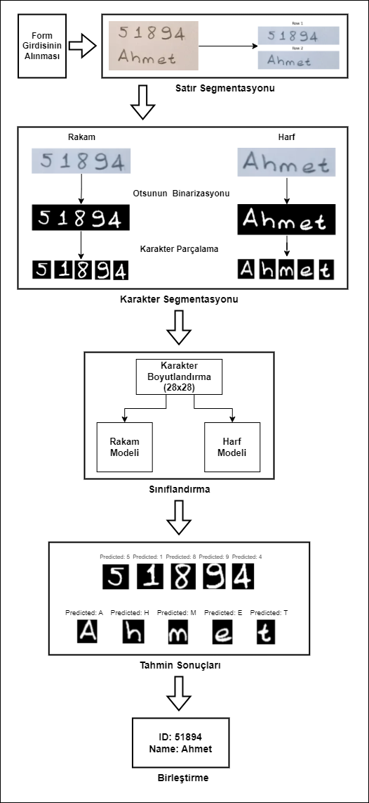

# Derin Öğrenme Yöntemiyle El Yazısını Dijitale Çeviren Web Uygulaması

Bu proje, kağıt üzerindeki el yazısı metinleri dijital formata dönüştüren bir sistem geliştirmek amacıyla hazırlanmıştır. Proje kapsamında, el yazısı harf ve rakamları sınıflandırmak için Convolutional Neural Network (CNN) tabanlı derin öğrenme modeli kullanılmış ve bir web arayüzü ile kullanıcı dostu bir deneyim sunulmuştur.

## Tasarım ve Yöntem

### Genel Sistem Tasarımı
Projenin genel çalışma yapısı şu aşamalardan oluşur:
1. **Veri Eldesi:** El yazısını içeren görüntülerin sisteme yüklenmesi.
2. **Segmentasyon:** Yüklenen görüntülerin satır ve karakter düzeyinde ayrıştırılması.
3. **Sınıflandırma:** Ayrıştırılan karakterlerin rakam ve harf sınıflarına atanması.
4. **Birleştirme:** Ayrıştırılmış karakterlerin kelimeler ve cümleler oluşturacak şekilde birleştirilmesi.
5. **Sonuçların Gösterimi:** Elde edilen metinlerin kullanıcıya sunulması ve PDF formatında kaydedilmesi.

Aşağıdaki şema, sistemin genel yapısını özetlemektedir:

  
_Şekil 1: Sistem Çalışma Şeması_

### Yöntem Detayları
1. **Veri Hazırlığı:**
   - Rakamlar için MNIST, harfler için EMNIST veri setleri kullanıldı.
   - Veri setleri, ön işleme adımlarıyla normalize edilerek eğitim sürecine hazır hale getirildi.

2. **Segmentasyon Aşamaları:**
   - **Satır Segmentasyonu:** Görüntü, satırlarına ayrılarak işlem kolaylaştırıldı.
   - **Karakter Segmentasyonu:** Satırlardaki karakterler ayrılarak 28x28 piksel boyutlarına ölçeklendi. Otsu Binarizasyon yöntemi kullanılarak arka plan etkileri en aza indirildi.

3. **CNN Tabanlı Model Eğitimi:**
   - MNIST ve EMNIST veri setleri için aynı CNN mimarisi kullanıldı.  
   - **CNN Mimari Özeti:** 
     - 3 adet Conv2D ve MaxPooling katmanı.
     - 3 adet Dense katmanı.
     - Dropout ile aşırı öğrenme kontrolü.
     - Optimizer: Adam, Loss Function: Sparse Categorical Crossentropy.
   - MNIST için eğitim doğruluğu %99, EMNIST için %93 olarak elde edildi.

4. **Web Uygulaması:**
   - Flask framework kullanılarak kullanıcı dostu bir arayüz oluşturuldu.
   - Arayüz, kullanıcılardan gerekli bilgileri alır, el yazısını içeren görüntüleri işler ve dijitalleştirilmiş metni hem ekranda hem de PDF formatında sunar.

### Kullanım Adımları
1. **Giriş Sayfası:**
   - Ad, soyad gibi temel bilgiler girilir.
   - Dijitalleştirilmek istenen form şablonu seçilir.
   
2. **Fotoğraf Yükleme:**
   - El yazısı formunun fotoğrafı sisteme yüklenir.
   - Yüklenen fotoğraf kırpılarak yalnızca el yazısı bölgesi seçilir.

3. **Sonuçların Gösterimi:**
   - İşlenen metin tablo formatında ekranda gösterilir.
   - Aynı zamanda PDF dosyası olarak indirilebilir hale getirilir.


[📹 Web Uygulamasının Örnek Bir Kullanımının Videosunu İzlemek İçin Tıklayın](https://drive.google.com/file/d/1DPAPBaXmMQwd0uG6VMSnR4J3NKavsu2Z/view?usp=drive_link)

<video width="600" controls>
  <source src="path/to/your-video.mp4" type="video/mp4">
  Tarayıcınız bu videoyu desteklemiyor.
</video>

## Kurulum
1. **Bağımlılıkların Kurulumu:**
   ```bash
   pip install -r requirements.txt
   ```
2. **Projeyi Klonlayın:**
   ```bash
   git clone https://github.com/kullanici_adi/proje_adi.git
   cd proje_adi
   ```
3. **Uygulamayı Çalıştırın:**
   ```bash
   python app.py
   ```

## Performans ve Sonuçlar
- **MNIST Model Performansı:**
  - Precision: 0.99, Recall: 0.99, F1 Score: 0.99
- **EMNIST Model Performansı:**
  - Precision: 0.92, Recall: 0.91, F1 Score: 0.91


## İletişim
Daha fazla bilgi için:
- Ayşegül Toptaş: [aysegulltoptass@gmail.com](mailto:aysegulltoptass@gmail.com)
- Havvanur Bozkurt: [havvabzkrt35@gmail.com](mailto:havvabzkrt35@gmail.com)
